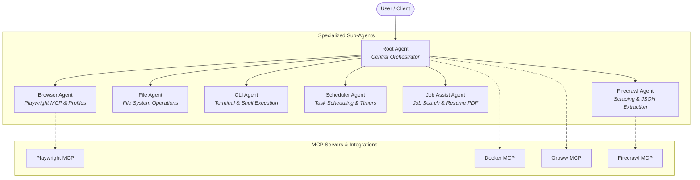

# Multi-Agent Orchestration Framework

A modular, multi-agent AI system built on top of **Google ADK (Agent Development Kit)**, **LiteLLM**, **MCP (Model Context Protocol)** servers, and **Rust / PyO3** native extensions.

The architecture employs a central orchestrator (`root_agent`) that coordinates specialized sub-agents to handle complex browser automation, file system operations, terminal command execution, job assistance & resume generation, scheduling, and high-speed web scraping.

---

## 🏛️ Architecture Overview



---

## 🤖 Agents & Capabilities

| Agent | Description | Key Tools & MCP Integrations |
| :--- | :--- | :--- |
| **`root_agent`** | Central orchestrator coordinating all tasks, short/long-term memory, time checks, and high-level decisions. | `getCurrentTime`, `DOCS_TOOLS`, Docker / Groww MCP |
| **`browser_agent`** | Autonomous web browsing agent with session and browser profile management. | `Playwright MCP`, `BROWSER_PROFILE_TOOLS` |
| **`file_agent`** | Local filesystem management (create, read, update, append, list, delete). | `FILE_TOOLS` |
| **`cli_agent`** | Terminal and command-line execution agent. | `CLI_TOOLS` |
| **`scheduler_agent`**| Task scheduling, timer registration, cron jobs, and background schedule management. | `SCHEDULE_TOOLS` |
| **`job_assist_agent`**| Job hunting assistant with automated professional PDF resume generation. | `RESUME_TOOLS` (`generate_resume_pdf`) |
| **`firecrawl_agent`**| Fast web scraping, domain sitemap crawling, web search, and structured schema JSON extraction. | `Firecrawl MCP` |

---

## 🔌 MCP (Model Context Protocol) Servers

- **Playwright MCP**: Headless or interactive Chromium browser automation with persistent session profiles.
- **Firecrawl MCP**: Web crawling, scraping, and LLM-driven structured extraction.
- **Docker MCP**: Management and execution within Docker containers.
- **Groww MCP**: Financial and investment data toolset integration.

---

## 🛠️ Tech Stack

- **Core Framework**: [Google ADK](https://github.com/google/agent-development-kit) (`google-adk[extensions]`)
- **LLM Routing**: [LiteLLM](https://github.com/BerriAI/litellm) (OpenAI-compatible endpoints, NVIDIA NIM, etc.)
- **Performance Layer**: Rust extensions via [PyO3](https://pyo3.rs/) and [Maturin](https://www.maturin.rs/)
- **Document & PDF Processing**: ReportLab & PyPDF2 / pdfplumber for resume generation and analysis

---

## 🚀 Getting Started

### 1. Prerequisites

- Python 3.10+ (or Python 3.8+)
- [Rust & Cargo](https://rustup.rs/) (for building PyO3 native bindings)
- [Node.js & npx](https://nodejs.org/) (for Playwright MCP and other server components)

### 2. Installation

Clone the repository and set up a virtual environment:

```bash
# Clone repository
git clone https://github.com/YashRaj9211/agents.git
cd agents

# Create & activate virtual environment
python -m venv .venv
# On Windows:
.venv\Scripts\activate
# On Linux/macOS:
source .venv/bin/activate

# Install Python dependencies
pip install -r requirements.txt

# Build and install Rust bindings in development mode
maturin develop
```

### 3. Environment Configuration

Copy or create a `.env` file in the project root:

```env
# Agent Model & Provider Configuration
ROOT_AGENT="nvidia/nemotron-3-super-120b-a12b"
ROOT_AGENT_BASE_URL="https://integrate.api.nvidia.com/v1"
ROOT_AGENT_KEY="your-api-key"

BROWSER_AGENT="nvidia/nemotron-3-super-120b-a12b"
BROWSER_AGENT_BASE_URL="https://integrate.api.nvidia.com/v1"
BROWSER_AGENT_KEY="your-api-key"

# Firecrawl API Key (optional for Firecrawl agent)
FIRECRAWL_API_KEY="your-firecrawl-key"

# Chroma Vector DB (Optional for vector storage)
CHROMA_HOST="api.trychroma.com"
CHROMA_API_KEY="your-chroma-key"
CHROMA_TENANT="your-tenant-id"
CHROMA_DATABASE="agents"

# Browser Mode
BROWSER_MODE="True"
```

---

## 📂 Project Structure

```text
agents/
├── agents/                  # Agent implementations
│   ├── root_agent/          # Orchestrator agent
│   ├── browser_agent/       # Web automation agent
│   ├── file_agent/          # Filesystem agent
│   ├── cli_agent/           # Terminal execution agent
│   ├── scheduler_agent/     # Task scheduling agent
│   ├── job_assist_agent/    # Resume & job hunting agent
│   ├── firecrawl_agent/     # Scraping & extraction agent
│   └── a2ui_agent/          # Agent-to-UI agent
├── mcp_servers/             # Model Context Protocol servers
│   ├── plawright.py         # Playwright browser MCP toolset
│   ├── firecrawl.py         # Firecrawl scraper toolset
│   ├── docker_mcp.py        # Docker container tools
│   └── groww_mcp.py         # Financial data tools
├── tools/                   # Custom tool collections
│   ├── browser_tools/       # Profile management tools
│   ├── cli_tools/           # CLI execution utilities
│   ├── docs_tool/           # Documentation indexing & retrieval
│   ├── file_tools/          # Filesystem manipulation tools
│   ├── resume_tools/        # PDF resume generator tools
│   ├── schedule_tools/      # Task scheduling tools
│   └── utility_tools/       # Time & general utilities
├── src/                     # Rust PyO3 native module (lib.rs)
├── Cargo.toml               # Rust package configuration
├── pyproject.toml           # Maturin & Python packaging configuration
├── requirements.txt         # Python dependencies
└── README.md                # Project documentation
```

---

## 💻 Usage Example

You can run and interact with the agents using the Google ADK runner:

```python
from agents.root_agent.agent import root_agent

# Run the root agent with an instruction
response = root_agent.run("Find 3 senior AI engineer roles in Berlin and generate a customized PDF resume for me.")
print(response)
```

---

## 📄 License

This project is licensed under the MIT License.
