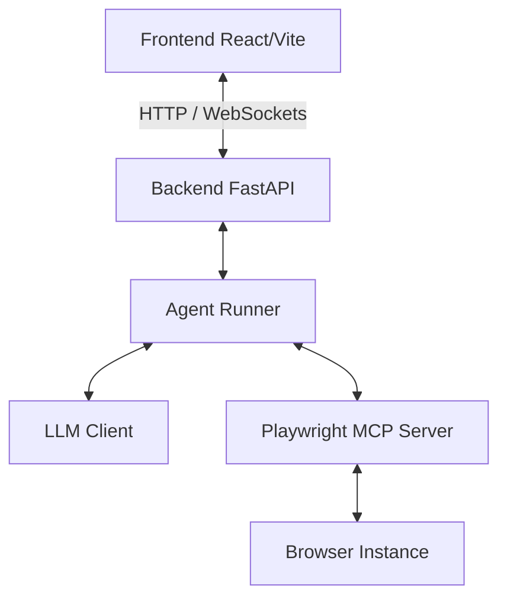

# 🌐 Web Automation Agent

An AI-driven browser automation assistant powered by Playwright and Model Context Protocol (MCP). It features a real-time web console UI and a flexible CLI interface designed to perform web search, navigation, and automated workflows (such as job searching and form pre-filling) safely and transparently.

---

## 🏗️ System Architecture



* **Frontend**: React-based dashboard that connects to the FastAPI backend, displaying live logs and browser steps as they happen.
* **Backend**: FastAPI web server that manages agent tasks, environment profiles, and streams execution logs.
* **Agent Runner**: The core control loop that translates natural language prompts into browser actions using tool-calling.
* **Playwright MCP**: A Model Context Protocol server that exposes browser automation actions (`click`, `type`, `navigate`, etc.) as tool APIs for the LLM.

---

## ✨ Features

* **Visual Web Console**: A clean dashboard UI to submit goals, monitor current agent steps, and view formatted log streams.
* **Smart Model-Driven Browsing**: Executes complex multi-step browser tasks using standard tool call loops.
* **Session Persistence**: Reuses a local browser profile so you can log in manually to web platforms once and remain authenticated.
* **Safe execution boundary**: Halts before performing irreversible actions, making payments, solving CAPTCHAs, or submitting passwords.

---

## 📋 Prerequisites

* **Node.js**: Version 18 or higher (required for Playwright MCP).
* **Python**: Version 3.10 or higher.
* **LLM API Credentials**: An OpenAI-compatible API key.

---

## 🚀 Getting Started

### 1. Clone & Prepare the Workspace

```bash
git clone https://github.com/YashRaj9211/agents.git
cd agents
```

### 2. Backend Setup

Navigate to the `backend` directory, set up your Python virtual environment, and install dependencies:

```powershell
cd backend
python -m venv .venv
.\.venv\Scripts\Activate.ps1
pip install -r requirements.txt
```

#### Configure Environment Variables
Copy `.env.example` to `.env` and fill in your model provider parameters:

```powershell
Copy-Item .env.example .env
```

Open `.env` and configure:
```env
LLM_API_KEY=your-api-key-here
LLM_MODEL=gpt-4o  # or your preferred OpenAI-compatible model
```

### 3. Frontend Setup

In a new terminal window, navigate to the `frontend` directory and install the Node modules:

```bash
cd frontend
npm install
```

---

## 🛠️ Usage

### Option A: Web UI Console (Recommended)

Start both services to use the graphical workspace:

1. **Start the FastAPI Backend**:
   From the `backend` directory with the virtual environment activated:
   ```powershell
   python -m uvicorn api.app:app --host 127.0.0.1 --port 3000
   ```

2. **Start the Frontend Dev Server**:
   From the `frontend` directory:
   ```bash
   npm run dev -- --port 5173
   ```

3. Open **[http://localhost:5173/](http://localhost:5173/)** in your browser to start tasks and view the agent's progress logs in real-time.

---

### Option B: Command Line Interface (CLI)

Run ad-hoc tasks directly from the `backend` directory:

```powershell
# Basic browser prompt
python main.py "Open wikipedia.org, search for 'Artificial Intelligence', and summarize the introduction."
```

#### Job-Search Skills
Place your resume at `backend/storage/files/input/resume.pdf` and create a profile at `backend/storage/files/input/profile.md` with your skills, experience, and preferences.

```powershell
# Find matching jobs and compile a list
python main.py --skill job_search "Search LinkedIn for remote React developer roles and save the top 5 matches."

# Draft and prepare applications (will halt before final submit)
python main.py --skill job_apply "Open the saved application URL and draft the answers using my resume."
```

---

## 🔐 Session Logins & Persistent Profiles

The browser profile is stored locally in `backend/storage/browser-profile` so that active cookies and sessions are preserved. To bypass bot detection or log into your Google, LinkedIn, or GitHub accounts manually:

```powershell
npx playwright open --user-data-dir=storage/browser-profile
```
*(Once logged in, close the browser window. The agent will inherit your authenticated session in subsequent runs.)*

---

## 🛡️ Safety Boundaries

* **No Auto-Submit**: The agent will fill out fields but will **never** click final checkout/submit buttons for transactions or form submissions without human confirmation.
* **Authentication & Secrets**: Passwords, MFA verification, and CAPTCHAs must be entered manually by you.
